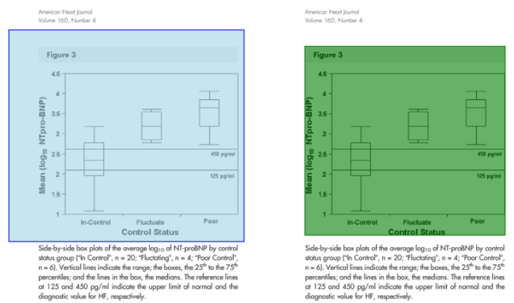
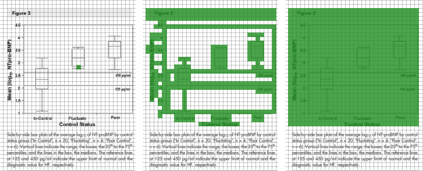
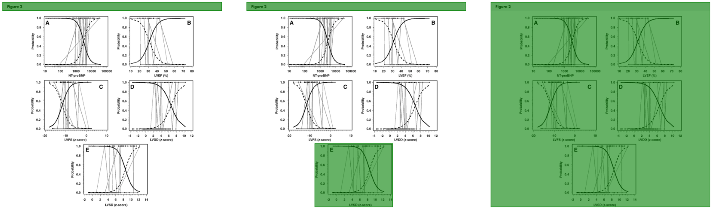
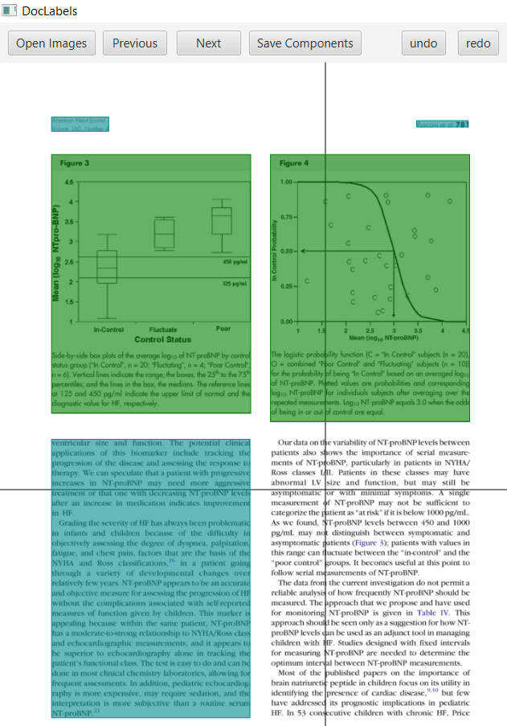
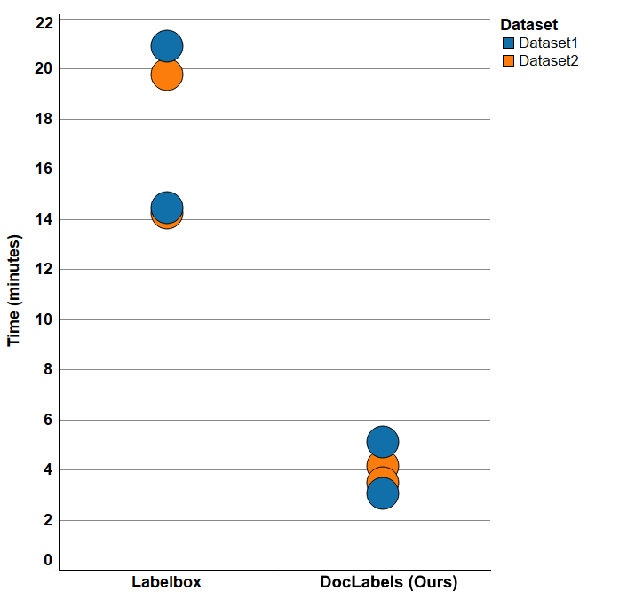

# DocLabels

DocLabels is a free, open-source semi-automated annotation tool specialized for article type documents like scientific publications.

### Smart Rectangular Selection

Scientific publications use different structures but they all of them can be divided into rectangular blocks. Both single and double column documents use a combination of text, figure, table, algorithm, formula and reference blocks, separated by whitespace padding. During our first manual labeling process, we noticed that selecting the exact borders of the components took a great amount of time and focus. It is necessary to decide the "right amount of borders" before labeling, especially if it is done by multiple people. By using human labour it is unrealistic to agree on a 0 pixel border width, as it would need absolute pixel correctness. The same argument can be made with any specific number of pixels. The best solution for the problem is to define the border as "as small as possible, but it must contain all pixels of the component of interest". The problem now is that border widths still vary, which might affect the quality of the final neural network predictions, and achieving a lower error still requires a great level of concentration which extends labeling time and increases costs.

The most simple solution to this problem is to require the labeling person only to select the component roughly, where the width of the whitespace border does not matter, then remove all rows and columns on the edges which contain white pixels only (Figure 1). After finding the non-white borders, it is also possible to extend the padding with a specific number of pixels, the goal is to use the same border width for all the selected components.

  

  <a>Figure 1: Smart rectangular selection - our tool can eliminate all white rows and columns on the borders in order to support precise labeling</a>

### Smart Clique Selection

In order to make the labeling process even faster, we developed a one-click solution of selecting rectangular components. The ideal solution of defining regions is that the user only clicks in the middle of the component, then the smart selection tool automatically finds the edges. As the components are bounded by whitespace regions, the problem can be interpreted as a clustering problem in the two dimensional pixel space, where data points are the non-white pixels. Using a well defined tolerance value, which defines the minimum space between two separated clusters (components) results in an optimal solution. However, as the optimal value depends not only on the structure of the publication, but also on the resolution of the image, we made a user interface which makes it easy to modify this value.

  

  <a>Figure 2: Smart CLIQUE selection finding connected units containing non-white pixels, thereby making one click selection possible</a>

Our solution is using a similar approach to [CLIQUE], it divides the document into a grid, consisting of square shaped units of a size based on the tolerance value. Clicking on one of the units selects the largest connected component, separated by units containing white pixels only (Figure 2). We recommend using a smaller tolerance value and if the automatically selected region is only a part of the full component, the user can hold the control button while clicking on the unselected region of the same component in order to join the two clusters as one selected rectangular region (Figure 3).

  

  <a>Figure 3: Joining sub-components by clicking and holding control key enables to use this method even when a figure is composed of disjoint components</a>

### Implementation

Our image annotation tool, DocLabels is a free, open source java application focused on the annotation of article type documents. Using the software consists of three steps, importing images, annotation itself and exporting the output files. The user can select multiple images in a popup window, after clicking on the "Open Images" button, then "Next" and "Previous" buttons or the arrow keys help navigating between them. Annotation is done page-by-page with the tools described above. Smart CLIQUE is done by simply clicking on a non-white area, while to use smart rectangular selection, the user has to drag the mouse over the area to select. Omitting whitespace regions on borders at the rectangle selection and the helping axis lines are both optional features, they can be turned off using the user interface. To make the annotation process faster, class id-s can be selected not only by clicking on a spinner, but also using the mouse wheel or the up/down arrow keys. Different class types are displayed by different colors for easier error detection (Figure 4). If an error still occurs, undo can be done by a simple right click.

  

  <a>Figure 4: Document annotation using DocLabels. Using different colors for different classes help error prevention and detection.</a>

DocLabels exports the components using two formats. One is an ImageMagick script that produces masked images with the same resolution as the labelled images, using the blue RGB channel as class id. The other output is a JSON file, containing the original resolution and rectangular component positions along with their class ids. Using this JSON format makes it easier to evaluate predictions, while mask images are used as an input for training the Neural Network model.

### Experiments

In order to investigate the difference of using traditional techniques and our approach specialized for article type documents like scientific publications, we have prepared and run a pilot user test with 4 users. We selected [LabelBox] as a reference tool, as it is a popular choice for image annotation chosen by companies like Airbus or FLIR Systems. Each of our test users got an introduction to the problem, then learned the controls and got comfortable with using the tool by labeling 2 publications. After the tutorial phase, we measured the time of annotating all *figures* in 5 publications (50 pages) using one tool, then we repeated the whole process using the other tool. The users were asked to make reasonably accurate annotations with all non-white pixels of the figure included in the rectangular area.

 We selected two subsets of the dataset VIS-CHI-100 publications for the two iterations of the tests. To avoid bias caused by the differences in the data, we used them equally with the two tools and we also alternated which tool was introduced to the user first. The users were all new to the problem of image annotation but they use computers in their work on a daily basis. The two male and two female participants are in between 25 and 60 years old.
 
The measured annotation times using our tool was multiple times faster for each user than the same process using Labelbox. Figure 5 shows the measured times that were required to label each dataset using each tool. The average annotation speed was 4.44 times faster using our tool. As our labeling technique is designed to find the perfect borders of rectangular components formulated by non-white pixels, the labelled regions produced by our tool are perfectly accurate. In contrast, perfect consistency is not achievable using traditional tools, regardless how much more time we might allocate.

  

  <a>Figure 4: Times used for annotating 'figure' components of five publications using Labelbox and DoLabels - an annotation tool implemented by us</a>

Running a user test with only 4 users already shows the benefits of using our annotation tool for article type documents, but to get a better overview of the exact difference and benefits, we should run a user test with an increased number of users and multiple labeling tools.

[CLIQUE]:https://www.cs.cornell.edu/johannes/papers/1998/sigmod1998-clique.pdf
[LabelBox]:https://labelbox.com/
